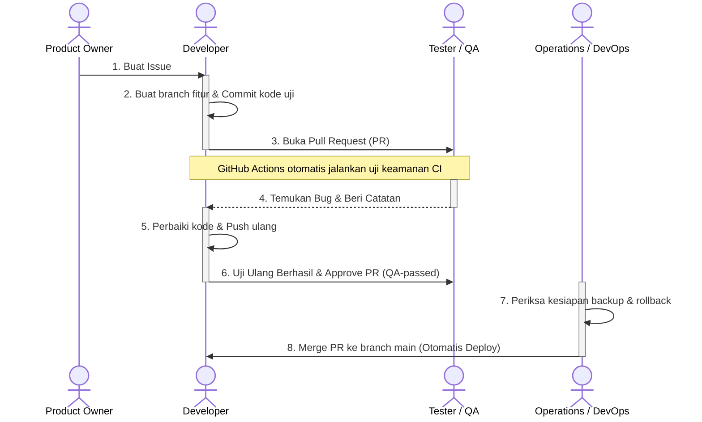

```mermaid
sequenceDiagram
    actor PO as Product Owner
    actor DEV as Developer
    actor QA as Tester / QA
    actor OPS as Operations / DevOps

    PO->>DEV: 1. Buat Issue
    
    activate DEV
    DEV->>DEV: 2. Buat branch fitur & Commit kode uji
    DEV->>QA: 3. Buka Pull Request (PR)
    deactivate DEV

    Note over DEV,QA: GitHub Actions otomatis jalankan uji keamanan CI

    activate QA
    QA-->>DEV: 4. Temukan Bug & Beri Catatan
    deactivate QA

    activate DEV
    DEV->>DEV: 5. Perbaiki kode & Push ulang
    DEV->>QA: 6. Uji Ulang Berhasil & Approve PR (QA-passed)
    deactivate DEV

    activate OPS
    OPS->>OPS: 7. Periksa kesiapan backup & rollback
    OPS->>DEV: 8. Merge PR ke branch main (Otomatis Deploy)
    deactivate OPS
```
